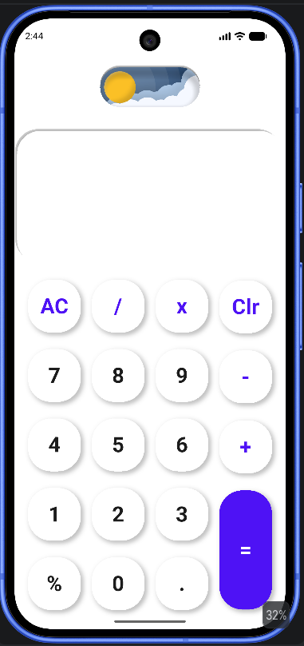
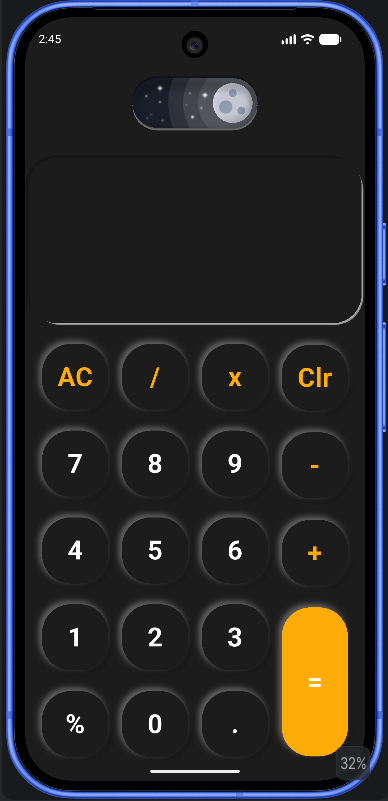

# 🧮 Flutter Calculator

A clean, themeable calculator app built with Flutter — featuring a smooth day/night theme toggle and animated button interactions.

---

## 📱 Screenshots

| Light Mode                      | Dark Mode                     |
|---------------------------------|-------------------------------|
|  |  |

---

## ✨ Features

- **Day / Night theme switch** — toggle between light and dark mode with a smooth animated switch
- **Animated buttons** — press feedback using `AnimatedContainer` with box shadow effects
- **Custom button widget** — supports equal button (tall variant) and standard buttons
- **Clean architecture** — separated into modules, screens, widgets, and utils
- **Responsive layout** — built and tested on Pixel 10 (Android)

---

## 🗂️ Project Structure

```
lib/
├── modules/
│   ├── calculator-model.dart       # Core calculator logic
│   ├── result_value_model.dart     # Result state management
│   └── theme_module.dart           # Theme configuration
├── screen/
│   └── calculator_screen.dart      # Main calculator UI
├── utils/
│   ├── app_colors.dart             # Color constants
│   └── app_text.dart               # Text styles
└── widgets/
    ├── custom_btn.dart             # Animated calculator button
    ├── custom_result_view.dart     # Result display widget
    └── custom_text.dart            # Text widget
```

---

## 📦 Dependencies

```yaml
dependencies:
  flutter:
    sdk: flutter
  day_night_themed_switch: ^1.0.0
```

---

## 🚀 Getting Started

**Prerequisites**
- Flutter SDK (3.x or above)
- Android Studio / VS Code with Flutter plugin
- Android or iOS emulator / physical device

**Setup**

```bash
# Clone the repo
git clone https://github.com/your-username/flutter-calculator.git
cd flutter-calculator

# Install dependencies
flutter pub get

# Run the app
flutter run
```

---

## 🎨 Theme

The app uses a `day_night_themed_switch` toggle to switch between:

- **Light mode** — blue/purple color scheme with shadow depth on buttons
- **Dark mode** — dark background with muted button surfaces

Theme state is managed via `theme_module.dart` and propagated through the widget tree.

---

## 🔘 Button Behavior

Each button uses a `GestureDetector` wrapped around a `ValueListenableBuilder`:

- On tap down → triggers `clickEffect()` (depressed shadow)
- On tap up (after 200ms delay) → triggers `unClick()` (raised shadow)
- The `=` button is taller (`isEqualBtn: true`) and uses the primary color

---

## 📋 Supported Operations

| Button | Function |
|--------|----------|
| `AC` | Clear all |
| `Clr` | Clear last entry |
| `+` `-` `x` `/` | Basic arithmetic |
| `%` | Percentage |
| `=` | Calculate result |

---

## 📄 License

MIT License. See [LICENSE](LICENSE) for details.